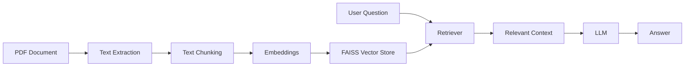

# RAG Document Q&A Agent

## About the Project

I built this project to understand how Retrieval-Augmented Generation (RAG) can be used to ask questions from a PDF document.

The application takes a PDF, finds the relevant information for a question, and uses an LLM to generate an answer.

## What I Did

- Added PDF upload
- Extracted text from the PDF
- Split the text into smaller chunks
- Created embeddings for the document
- Stored the embeddings using FAISS
- Retrieved relevant parts of the document
- Used an LLM to generate the answer
- Displayed the retrieved context along with the answer
- Added basic error handling

## Tools Used

- Python
- LangChain
- FAISS
- NVIDIA AI Endpoints
- Gradio
- PyPDF

## How It Works
## Architecture


PDF  
↓  
Text Extraction  
↓  
Text Chunking  
↓  
Embeddings  
↓  
FAISS  
↓  
Relevant Context  
↓  
LLM  
↓  
Answer

## Using the Application

1. Upload a PDF.
2. Enter a question about the document.
3. Click **Submit**.
4. The application shows the answer.
5. The retrieved context can also be viewed.

## Testing

I tested the application with a sample PDF and asked questions about:

- Beneficiary details
- Bank account verification
- What happens when verification fails
- Required bank account information
- Beneficiary bank account name verification

The application returned relevant answers and the retrieved document context.

## Project Files

```text
rag-document-qa-agent/
│
├── app.py
├── requirements.txt
└── README.md
```


## What I Want to Add Next

- Support for more document formats
- Source and page references
- Better retrieval
- Conversation history
- Deployment of the application

## Status

This is my RAG project, and it is currently working.
